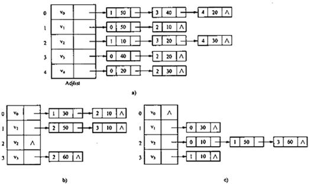
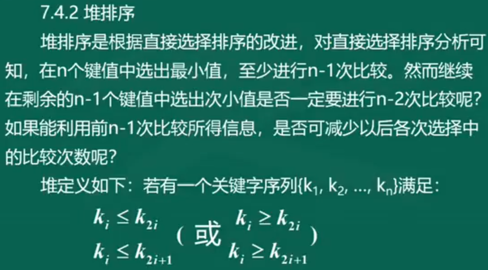

# 第一章 概论

## 1.数据结构基本概念和术语

### 1.1 数据、数据元素、数据项

- 数据元素是数据的基本单位（数据由若干个数据元素组成）
- 数据项是数据元素的基本单位（数据元素由若干个数据项组成）

### 1.2 数据的逻辑结构

- 数据的逻辑结构是指数据元素之间的逻辑关系（逻辑关系指数据元素之间的关联方式或灵界关系）

### 1.3 四种基本逻辑结构

- **集合** （没有邻接关系，组织形式松散）

- **线性结构**（依次排列形成一条“链”）
- **树形结构**（具有分支、层次特性，像自然界中的树）
- **图结构**（任何两个结点都可以相邻接）


### 1.4 数据存储结构

- 存储数据元素
- 数据元素之间的关联方式
  - 顺序存储方式（数组）
  - 链式存储方式（链表）

## 2. 算法分析

### 2.1 算法的评价因素

- 正确性
- 易读性
- 健壮性
- 时空性（时间效率、空间效率）

### 2.2 时间复杂度 ★

- 概念：算法的时间复杂度是算法中基本运算重复执行次数的度量
- 公式：T（n） = O（f(n)）
- 阶数：
  - **常数阶 O（1） ——无循环**
  - **对数阶 O（logn）——递归**
  - **线性阶 O（n）——单层循环**
  - **多项式阶 O（n^c）——c层循环**
  - **指数阶 O（2^n）**

- 最坏时间复杂度：算法时间用量最大
- 平均时间复杂度：算法时间用量平均值
- 阶数低于平方阶的算法是高效率的

### 2.3 空间复杂度

- 算法在执行期间所需要的存储空间量包括以下三个部分
  - 程序代码所占空间
  - 输入数据所占空间
  - 辅助变量所占空间

# 第二章 线性表

## 1.线性表的基本概念

### 1.1 线性表的基本特征

- 一对一的关系
- 除起始结点没有直接前驱外，其他每个结点都有一个直接前驱
- 除终端结点没有直接后继外，其他每个结点都有一个直接后继

### 1.2 线性表基本运算的功能

> （表：L，x：元素值，i：元素结点）

- 初始化 Initiate(L)
- 表长 Length(L)
- 读表元素 Get(L，i)
- 定位 Locate(L，x)
- 插入 Insert（L，x，i）
- 删除 Delete(L，i)

## 2.线性表的顺序存储

- 顺序表的定义

  ```c
  const int Maxsize = 100;	//预先定义一个足够大的常数
  typedef struct
  {
      DataType data[Maxsize];	//存放数据的数组
      int length;				//顺序表的实际长度
  }
  SeqList;					//顺序表类型名为SepList
  SeqList L;					//定义L为一个顺序表
  ```

  

### 2.1 插入运算

- 实现步骤

  

- 实现代码

  ```c
  void InsertSeqlist(SeqList L,DataType x,int i){
      //将元素x插入到顺序表L的第i个数据元素之前
      if(L.length == Maxsize) exit("表已满");
      if(i < 1 || i < L.length + 1) exit("位置错误");
      for(i = L.length; j >= i; j--)
          L.data[j] = L.data[j - 1];
      L.data[i - 1] = x;
      L.length++;
  }
  ```

  

### 2.2 删除运算

> 实现代码 (P14)

### 2.3 定位运算

> 实现代码(P15)

### 2.4 算法的分析

- 插入：O（n）
- 删除：O（n）
- 定位：O（n）

## 3.线性表的链式存储

### 3.1 常见的链式存储结构

- 单链表
- 循环链表
- 双向循环链表

### 3.2 单链表

- 单链表由数据元素（data部分称为数据域）和指针（next部分称为指针域和链域）组成

  

  

- 非空单链表

  

- 单链表定义

  ```c
  typedef struct node
  {
      DataType data;		//数据域
      struct node * next;//指针域
  }Node, *LinkList;
  ```

  

> 表长：除了头结点以外的结点的个数

- 求表长代码

  ```c
  int LengthLinklist(Linklist head)
  {
      Node * p = head;				//p是工作指针 初始时p指向头结点
      int cnt = 0;					//计数器置0
      while(p->next != null)			//判断是否为尾结点
      {
          p = p->next;				//指针移动到下一个结点
          cnt++;
      }
      return cnt;
  }
  ```

- 读表元素

  > 在单链表head中查到第i个元素结点 若找到 返回指向该结点的指针

  ```c
  Node * GetLinklist(Linklist head,int i)
  {
      Node *p;
      p = head->next;
      int c = 1;
      while((c<i) && (p != null))
      {
          p = p->next;
          c++;
      }
      if(i == c)
      {
          return p;
      }
      else
      {
          return null;
      }
  }
  ```

- 定位

  > 找到表head中第一个值等于x的结点的序号

  ```c
  int LocateLinklist(ListList head,DataType x)
  {
      Node *p = head;		
      p = p->next;		//初始时p指向首结点
      int i = 1;			//i代表结点的序号，初值为0
      while(p != null && p -> data != x)//访问链表
      {
          i++;
          p = p->next
      }
      if(p != null)
      {
          return i;
      }
      else
      {
          return 0;
      }
  }
  ```

- 插入结点

  > 在表head的第i个数据元素结点之前插入一个以x为值的新结点
  >
  > 1. 新结点指向第i个数据元素结点
  > 2. 第i-1个数据元素结点指向新结点

  

  ```c
  void InsertLinklist(LinkList head,DataType x,int i)
  {
      Node *p,*q;
      if(i == 1)
      {
          q = head;
      }else
      {
          q = GetLinklist(head,i-1);			//找到第i-1个数据元素
      }
      if(q == null)							//第i-1个结点不为空
      {
          exit("找不到插入的位置")
      }else
      {
          p = malloc(sizeof(Node));			//生成新结点
          p -> data = x;						
          p -> next = q -> next;				//新结点链域指向*q的后继节点
          q -> next = p;						//修改*q的链域
      }
  }
  ```


- 删除结点

  > 1. 待删结点的直接前驱指向待删结点的直接后继
  > 2. 用free(待删结点)删除结点

  

  ```c
  void DeleteLinklist(LinkList head, int i)
  {
      Node *q,*p;
      if(i == 1)
      {
          q = head;
      }else
      {
          q = GetLinklist(head, i-1)		//先找待删结点的直接前驱
      }
      if(q != null && q ->next != null){	//若直接前驱存在且待删结点存在
          p = q -> next;					//p指向待删结点
          q -> next -> p -> next;			//待删结点的直接前驱指向待删结点的直接后继
          free(p);						//释放待删结点的空间
      }else
      {
          exit("找不到要删除的节点")
      }
  }
  ```

### 3.3 其他运算在单链表上的表现

- 建表

  > 1. 建立带头结点的空表
  > 2. 建立一个新结点
  > 3. 头结点指向新结点

  ```c
  LinkList CreateLinklist()
  {
      Linklist head;
      Node *q,*t;
      int x;
      head = malloc(sizeof(Node))			//生成头结点
      q = head;							//尾指针置初值
      scanf("%d",&x);						//读取第一个元素
      while(x != 0)						//输入是否是结束标志
      {
          t = malloc(sizeof(Node));		//生成一个新结点
          t -> data = x;					
          q -> next = t;					//新结点t链入
          q = t;							//修改尾指针q 指向新的尾结点
          scanf("%d",&x)					//读入下一个元素
      }
      q - > next = null;					//q指向尾结点 置尾结点标志
      return head;
  }
  ```

### 3.4 其他链表

- **循环链表**（单链表中让最后一个结点的指针域指向第一个结点可以构成循环链表）

- **双向循环链表**（比单链表多一个prior结点指向直接前驱结点）

  - 头结点的priot指向尾结点

  - 尾结点的next指向头结点

  - 对称性

    - p = p -> prior ->next = p -> next -> prior

  - 在单链表中 找直接后继结点的时间复杂度是 O （1）

  - 在双向循环列表中 找直接后继结点和前驱结点的时间复杂度是O（1）

  - 双向循环链表删除结点

    1. p -> prior -> next = p -> next

       p -> next -> prior = p ->prior

    2. free(p)

  - 双向循环链表插入结点（在p所指结点的后面插入一个新结点*t 需要修改四个指针）

    
    
    1. t  -> prior = p
    2. t -> next = p -> next
    3. p -> next -> prior = t
      4. p -> next = t

# 第三章 栈、队列和数组

## 1.栈

### 1.1 栈的基本概念

- 允许进行插入和删除的一端称为栈顶，另一端称为栈底
- 不含任何数据元素的栈称为空栈
- 处于栈顶位置的数据元素称为栈顶元素
- 特征：先进后出、后进先出

### 1.2 栈的基本运算

1. 初始化InitStack(S)：构造一个空栈S
2. 判栈空EmptyStack(S)：若栈S为空，则结果为1
3. 进栈Push(S,x)：将元素x插入栈S中
4. 出栈Pop(S)：删除栈顶元素
5. 取栈顶GetTop(S)：返回栈顶元素

### 1.3 栈的顺序实现


#### 1.3.1 顺序栈定义

```c
const int maxsize = 6
typedef struct seqstack
{
    DateType date[maxsize];
    int top;
}SeqStk;
```


#### 1.3.2 初始化顺序栈

> 构造一个空栈S

```c
int initStack(SeqStk *stk)
{
    skt -> top = 0;
    return 1;
}
```


#### 1.3.3 判栈空

> 若栈S为空，则结果为1,否则为0

```c
int EmptyStack(SeqStk *stk)
{
    if(stk -> top == 0) //判断栈顶的top是否指向栈底0
    {
        return 1;
    }else
    {
        return 0;
    }
}
```


#### 1.3.4 进栈

> 将元素x插入栈S中

```c
int Push(SepStk *stk,DataType x)
{
    if(stk -> top == maxsize - 1)//判断栈是否满
    {
        error("栈已满")
        return 0;
    }else
    {
        stk -> top++;			//栈未满 top+1
        stk -> data[stk -> top] = x;//元素x进栈
        return 1;
    }
}
```

#### 1.3.5 出栈

> 删除栈顶元素

```c
int Pop(SepStk *stk)
{
    if(EmptyStack(stk)) //判断栈是否为空
    {
        error("下溢");
        return 0;
    }else
    {
        stk -> top--;
        return 1;
    }
}
```

#### 1.3.6 取栈顶元素

> 返回栈顶元素

```c
DataType GetTop(SeqStk *stk)
{
    if(EmptyStack(stk))
    {
        return NULLData;
    }else
    {
        return stk -> data[stk -> top];
    }
}
```

### 1.4 栈的链接实现


#### 1.4.1 链栈定义

```c
typedef struct node
{
    DataType data;
    struct node * next;
}LkStk
```

#### 1.4.2 链栈初始化

```c
void InitStack(LkStk *LS)
{
    LS = (LkStk *)malloc(sizeof(LkStk));
    LS -> next = NULL;//建立一个空栈
}
```

#### 1.4.3 判栈空

```c
int EmptyStack(LkStk *LS)
{
    if(LS -> next == NULL)
    {
        return 1;
    }else
    {
        return 0;
    }
}
```

#### 1.4.4 进栈


```c
void Push(LkStk *LS,DataType x)
{
    LkStk *temp;
    temp = (LkStk *)malloc(sizeof(LkStk));	//temp指向申请的新结点
    temp -> data = x;				//新结点的data域赋值x
    temp -> next = LS -> next;//temp的next域指向原来LS指向的栈顶结点
    LS -> next = temp;		//LS的next域指向新的栈顶结点temp
}
```

#### 1.4.5 出栈

```c
int Pop(LkStk *LS)
{
    LkStk *temp;
    if(!EmptyStack(LS))
    {
        temp = LS -> next;			//temp指向栈顶结点
        LS -> next = temp -> next;	//原栈顶的下一个结点成为新的栈顶
        free(temp);
        return 1;
    }else
    {
        return 0;
    }
    
}
```

#### 1.4.6 取栈顶元素

```c
DataType GetTop(LkStk *LS)
{
    if(!EmptyStack(LS))
    {
        return LS -> next -> data;
    }else
    {
        return NULLData;
    }
}
```

## 2.队列

### 2.1 队列的基本概念

- 队列是一种先进先出的线性表
- 新加入的数据元素插在队列尾端
- 出队列的数据元素在队列首部被删除
- 队首指针：front
- 队尾指针：rear


### 2.2 队列的基本运算

1. 队列初始化 InitQueue(Q)：设置一个空队列Q
2. 判队列空EmptyQueue(Q)：若队列Q为空，返回1
3. 入队列EnQueue(Q)：将数据元素x从队尾一段插入队列，成为队列的新尾元素
4. 出队列OutQueue(Q)：删除队列首元素
5. 取队列首元素(Q)：返回队列首元素的值


### 2.3 队列的顺序实现


#### 2.3.1 顺序队列定义

```c
const int maxsize = 20;
typedef struct seqqueue
{
    DataType data[maxsize];
    int front,rear;
}SeqQue;
SeqQue SQ;
```


#### 2.3.2  循环队列

- 求rear指针：

> rear = (front + length) % maxsize


- 循环队列满条件：((CQ.rear + 1) % maxsize == CQ.front)

- 循环队列空条件：(CQ.rear == CQ.front)


#### 2.3.3 队列初始化

```c
void InitQueue(CycQue CQ)
{
    CQ.front = 0;
    CQ.rear = 0;
}
```


#### 2.3.4 判队列空

```c
int EmptyQueue(CycQue CQ)
{
    if(CQ.rear == CQ.front)
    {
        return 1;
    }
    else
        return 0;
}
```


#### 2.3.5 进队列

```c
int EnQueue(CycQue CQ,DataType x)
{
    if((CQ.rear + 1) % maxsize == CQ.front)
    {
        error("队列满");
        return 0;
    }else
    {
        CQ.rear = (CQ.rear + 1)%maxsize;
        CQ.data[CQ.rear];
        return 1;
    }
}
```


#### 2.3.6 出队列

```c
int OutQueue(CycQue CQ)
{
    if(EmptyQueue(CQ))
    {
        error("队列空")
    }else
    {
        CQ.front = (CQ.front + 1) % maxsize;
        return 1;
    }
}
```


#### 2.3.7 取队列首元素

```c
DataType GetHead(CycQue CQ)
{
    if(EmptyQueue(CQ))
    {
        return NULLData
    }else
    {
        return CQ.data[(CQ.front + 1) % maxsize];
    }
}
```

### 2.4 队列的链接实现


#### 2.4.1 链队定义

```c
typedef struct LinkQueueNode
{
    DataType data;
    struct LinkQueueNode *next;
}LkQueNode;
typedef struct LkQueue
{
    LkQueNode *front,*rear;
}LkQue;
LkQue LQ;
```


#### 2.4.2 链队队空

- LQ.front == LQ.rear


#### 2.4.3 链队初始化

```c
void InitQueue(LkQue *LQ)
{
    LkQueueNode *temp;
    temp = (LkQueNode *)malloc(sizeof(LkQueNode));//生成队列的头结点
    LQ -> front = temp;//队列头指针指向队列头结点
    LQ -> rear = temp;//队列的尾指针指向队列尾结点
    (LQ -> front) -> next = NULL;
}
```


#### 2.4.4 判链队空

```c
int EmptyQueue(LkQue *LQ)
{
    if(LQ.rear == LQ.front)
        return 1;
    else
        return 0;
}
```


#### 2.4.5 进链队

```c
void EnQueue(LkQueue *LQ,DataType x)
{
    LkQueNode *temp;
   	temp = (LkQueNode *)malloc(sizeof(LkQueNode));
    temp -> data = x;
    temp -> next = NULL;
    (LQ -> rear) -> next = temp;	//新结点入队列
    LQ -> rear  = temp;
}
```


#### 2.4.6 出链队

```c
int OutQueue(LkQue *LQ)
{
    LkQueNode *temp;
    if(EmptyQueue(CQ))
    {
        error("队空");
        return 0;
    }else
    {
        temp = (LQ -> front) -> next;
        (LQ -> front) -> next = temp -> next;
        if(temp -> next == NULL)//判定移除temp结点后是否仅剩front和rear所指结点
        {
            LQ -> rear = LQ -> front;//头指针和尾指针都指向头结点
            free(temp);
            return 1;
        }
    }
}
```


#### 2.4.7 取链队首元素

```c
DataType GetHead(LkQue *LQ)
{
    LkQueNode *temp;
    if(EmptyQueue(LQ))
    {
        return NULLData;
    }else
    {
    	temp = LQ.front -> next;
        return temp -> data;
    }
}
```


## 3.数组

### 3.1 数组的存储结构


- 一维数组的内存单元地址是连续的
- 二维数组由两种存储方法：以列/行序为主序存储，通常采用行序存储

### 3.2 `特殊矩阵（为了节省存储空间）、

#### 3.2.1 对称矩阵 （P39)

#### 3.2.2 三角矩阵（P40) 

#### 3.2.3 稀疏矩阵 


可存储为一个数组

**（0，1，5），（2，1，-1），（2，3，7），（3，1，6），（4， 4，9）**

# 第四章 树和二叉树

## 1.树

### 1.1 树的基本概念

#### 1.1.1 树的概念

- 树是n个结点的有限集合(n>=0)
  - n = 0 成为空树
  - n >= 0 有且只有一个称为根的结点 其他的结点分为互不相交的非空集合T1，T2,...,每一个集合称为根的子树
- 树形结构中一个结点可以由一个或多个直接后继
- 树形结构中一个结点只能由一个直接前驱


#### 1.1.2 树的相关术语

1. `结点的度`：树上任一结点所拥有的子树的数目

2. `叶子、终端结点`：度为0的结点

3. `树的度`：一棵树中所有结点的度的最大值

4. 子结点 == 孩子：一个结点的子树的根

5. 父结点 == 双亲

6. `结点的层次`：从根开始算起，根的层次为1，其余结点的

   层次为其父结点的层次加1

7. `树的高度`：一棵树中所有**结点层次**数的最大值

8. `*有序树：树中各结点的子树从左到右有次序，不能互换

   有序树左边第i个子树的根称为第i个孩子

9. *无序树：树中各结点的子树是无次序，可以互换

### 1.2 树的基本运算

1. 求根  	--> 查找

2. 求双亲   -->查找

3. 求孩子   -->查找

4. 建树

5. 剪枝 -->删除

6. 遍历

   

## 2. 二叉树

### 2.1 二叉树的基本概念

#### 2.1.1 二叉树的概念

- 二叉树是n(n>=0)个元素的有限集合，该集合或者为空，

  或者由一个根及两棵互不相交的左子树和右子树组成

  其中左子树和右子树也均为二叉树

- 二叉树的任一结点都有两棵子树- （他们中任何一个都

  可以是空子树），并且这两棵子树之间有次序关系	

  

#### 2.1.2 二叉树的基本形态


### 2.2 ★二叉树的基本运算

1. 初始化	 -->建立空二叉树
2. 求双亲     -->查找 
3. 求左孩子 -->查找 
4. 建立二叉树
5. ★先序遍历
6. ★中序遍历
7. ★后序遍历
8. 层次遍历


### 2.3 ★二叉树的性质

1. 二叉树第 i （i >= 1）层上至多有2^（i-1）个结点

2. 深度为k（k>=1）的二叉树至多有2^k（-1）个结点

3. 对任何一棵二叉树，若度数为0的结点（叶结点）

   个数为n0，度数为2的结点个数为n2，则n0 = n2 + 1
   
   

### 2.4 满二叉树

- 深度为k（k >= 1）且又2^k（-1）个结点的二叉树

  

### 2.5 完全二叉树

- 如果对满二叉树从上到下，从左到右的顺序编号，并在最下一层删去部分

   结点（删后最后一层仍有结点），如果删除的这些结点的编号是<u>**连续**</u>的且

  删除的结点中含有**<u>最大编号</u>**的结点

  

- `完全二叉树的性质`

  - 含有n个结点的完全二叉树的深度为（log2n）的向下取整+1

  - 如果将一棵有n个结点的完全二叉树按层编号，按层编号是指

    将一棵二叉树中的所有n个结点按从第一层到最大层，每层从

    左到右的顺序依次标记为1、2、3、n。则对任意编号为i（1<=i

    <=n）的结点有：

    - 若i = 1，则结点A是根；若i > 1， <u>**则A的双亲Parent(A)的编号**</u><u>**为i / 2的向下取整**</u>

    - **若 2*i > n 则结点既无左孩子，也无右孩子；<u>否则A的左孩子</u>**

      **<u>Lchild（A）的编号为2*i</u>**

    - 若 2*i + 1 > n，则结点A无右孩子；否则，<u>**A的右孩子Rchild(A)**</u>

      <u>**的编号为2 * i + 1**</u>


### 2.6 二叉树的存储结构

> 二叉树通常有两类存储结构：顺序存储结构、链式存储结构

#### 2.6.1 二叉树的顺序存储结构

> 二叉树的顺序存储结构可以用一维数组来实现

- 二叉树的顺序存储结构图

  

  完全二叉树：

  

  非完全二叉树：

  - 将非完全二叉树设计成填充为满二叉树  填充部分分配空间不存值


#### 2.6.2 二叉树的链式存储结构

> 二叉树有不同的链式存储结构，其中最常用的是二叉链表与三叉链表

- 二叉链表和三叉链表的基本存储结构图

  


- 二叉链表的定义

  ```c
  typedef struct btnode
  {
      DataType data;
      struct btnode *lchild,*rchild;
  }*BinTree
  ```

- 三叉链表的定义

  ```c
  typedef struct ttnode
  {
      DataType data;
      struct ttnode *lchild,*rchild,*parent;
  }*TBinTree;
  TBinTree root;
  ```

- 二叉链表和三叉链表的存储结构图

  


### 2.7 二叉树的遍历

#### 2.7.1 二叉树遍历的递归实现

1. **先序遍历**
   1. 访问根节点
   2. 先序遍历左子树
   3. 先序遍历右子树
2. 中序遍历
   1. 中序遍历左子树
   2. 访问根节点
   3. 中序遍历右子树
3. 后序遍历
   1. 后序遍历左子树
   2. 后序遍历右子树
   3. 访问根节点


#### 2.7.2 遍历的递归算法代码

- `先序`

  ```c
  void preorder(BinTree bt)
  {
      if(bt != NULL)
      {
          visit(bt);				//访问根节点bt
          preorder(bt -> lchild);	//先序遍历左子树
          preorder(bt -> rchild);	//先序遍历右子树
      }
  }
  ```

- `中序`

  ```c
  void inorder(BinTree bt)
  {
      if(bt != NULL)
      {
          inorder(bt -> lchild);
          visit(bt);
          inorder(bt -> rchild);
      }
  }
  ```

- `后序`

  ```c
  void postoder(BinTree bt)
  {
      if(bt != NULL)
      {
          postoder(bt -> lchild);
          postoder(bt -> rchild);
          visit(bt);
      }
  }
  ```


### 2.8 判定树和哈夫曼树

#### 2.8.1 分类与判定树

- `判定表`

  

- `判定树`

  

#### 2.8.2 哈夫曼编码和哈夫曼树

- `题型`

  

  

- 

# 第五章 图

## 1.图的基本概念

### 1.1 图的应用背景

- 在N个城市间建立通信网络，使得其中的任意亮哥城市之间有直接或

  间接的通信网络，N很大时，要找出一个总造价的最低的通信网络，

  只能借助计算机来求解

  

### 1.2 图的定义和术语

- **`有向图、无向图`**：图G由两个集合V和E组成，记为G=（V，E）

  其中，V是顶点的有穷非空集合；E是边的集合，边是V中顶点

  的偶对。如果边是有方向的则称为有向图，否则称为无向图。

  偶对<v，w>表示有向图中从顶点v到顶点w有一条边；

  偶对(v，w)表示无向图中顶点v和顶点w间有一条边。

- **`弧、弧头、弧尾`**：有向图的边称为弧。

  <v，w>表示有向图G中从v到w的一条弧

  v称为弧尾或始点，w称为弧头或终点

- **`无向完全图`**：任何两点之间都有边的无向图。一个具有n个顶点

  的无向完全图的边数为

- **`有向完全图`**：任何两点之间都有弧的有向图称为有向完全图。

  一个具有n个顶点的有向完全图的弧数为

- **`权、带权图`**：图的边附带数值，这个数值叫权。权在实际应用中可

  表示从一个顶点到另一个顶点的距离、代价或耗费等。每条边

  都带权的图称为带权图；

- **`顶点的度、入度、出度`**：无向图中**顶点v的度**是与该顶点相关联的

  边的数目。

  如果G是一个有向图，则把以顶点v为终点的弧的数目

  称为**顶点v的入度**

  把以顶点v为始点的弧的数目称为**顶点v的出度**

  

  <u>**有向图中顶点v的度为入度和出度的和**</u>

- **`子图`**：设G = （V，E）是一个图，若E`  是E的子集，V`` 是V的子集，

  并且E`   中的边仅与V ``    中的顶点相关联，则图G```   =  （V````   ，E`````   ）称为

  图G的子图

- `路径、路径长度`：路径上边（或弧）的数目称为路径长度

  

- `简单路径、回路、简单回路`：序列中顶点不重复出现的路径称为**简单路径**。第一个顶点和最后一个顶点相同的路径称为**回路或环**。除了第一个顶点和最后一个顶点外，其余顶点不重复的回路，称为**简单回路或简单环**

- `连通、连通图、连通分量`：在无向图中，如果从顶点V到顶点V'有路径，则称V和V'是连通的。如果图中的任意两个顶点Vi和Vj都是连通的，则称G为连通图。图5－5a中存在多个不连通顶点。例如，V0和V3是不连通的，所以G3是非连通图，G3有两个连通分量，如图5－5b所示。**连通分量是无向图中的极大连通子图**。

  

- `强连通、强连通图、强连通分量`：对于有向图来说，如果图中任意一对顶点Vi和Vj（其中i≠j）都有顶点Vi到顶点Vj的路径，也有从Vj到Vi的路径，即两个顶点间双向连通，那么称该有向图是**强连通图**。有向图的极大连通子图称为**强连通分量**，强连通分量如图

  

- `生成树`：一个连通图的生成树，是含有该连通图的全部顶点的一个极小连通子图。若连通图G的顶点个数为n，则G的生成树的边数为n-1。如果G的一个子图G'的边数大于n-1，则G'中一定有环。相反，如果G'的边数小于n-1，则G'一定不连通。

- `生成森林`：在非连通图中，由每个连通分量都可得到一个极小连通子图，即一棵生成树。那么这些连通分量的生成树就组成了一个非连通图的生成森林。

  

## 2. 图的基本运算

1. `建立图CreateGraph（G，V，E）`：建立一个图G，其中V是G的顶点集合，E是G的边的集合
2. `取顶点信息GetVex（G，u）`：获取图G中顶点u的信息；
3. `取边信息Getarc（G，u，v）`：获取图G中边（u，v）或<u，v>的信息；
4. `查询第一个邻接点FirstVex（G，u）`：获取图G中顶点u的第一个邻接点；
5. ` 查询下一个邻接点NextVex（G，u，v）`：已知v是u的一个邻接点，获取图G中顶点u的下一个邻接点；
6. `插入顶点InsertVex（G，v）`：在图G中插入一个顶点v；
7. ` 删除顶点DeleteVex（G，v）`：在图G中删除一个顶点v；
8. `插入边InsertArc（G，v，w）`：在图G中插入一条边（v，w）或<v，w>；
9. `删除边DeleteArc（G，v，w）`：在图G中删除一条边（v，w）或<v，w>；
10. ` 遍历图Traverse（G，tag）`：遍历图G，使G中每个顶点被访问一次且仅被访问一次，当tag=0，则遍历的方法为深度优先搜索，当tag=1，则遍历的方法为广度优先搜索。


## 3. 图的存储结构

#### 3.1 邻接矩阵

- 邻接矩阵就是用矩阵来描述图中顶点之间的关联关系，在程序设计语言中我们用二维数组来表示矩阵。

- 设G=（V，E）是一个图，其中V={V0，V1，…，Vn-1}，那么G的邻接矩阵A定义为如下的n阶方阵：

  A[ i ] [ j ] = 

  - 有向图

    

  - 转化为邻接矩阵（**左边一列指向上边一行**）

     

  - 无向图转化为邻接矩阵

    

  - `有向无向图存储结构类型定义`

    ```c
    const int vnum = 20;
    typedef struct gp
    {
        VertexType vexs[vnum];//顶点信息
        int arcs[vnum][vnum]; //邻接矩阵
        int vexnum,arcnum;//顶点数，边数
    }Graph;
    ```

    

  - 有向无向带权图转化为邻接矩阵

  

  - `带权图存储结构类型定义`

    ```c
    const int vnum = 20;		//顶点数
    const int MAX_INT = 32767;	//无穷符号
    typedef struct gp
    {
        VertexType vexs[vnum];
        WeightType arcs[vnum][vnum];//存权值类型的数组
        int vexnum,arcnum;
    }WGraph
    ```

#### 3.2 邻接表

- 

  |       表头结点形式        | vertex数值域 | firstarc指针域 |
  | :-----------------------: | :----------: | :------------: |
  |        表结点形式         |    adjvex    |    nextarc     |
  | 带权图表结点形式   adjvex | weight数据域 |    nextarc     |

  

- 无向图的邻接表 

  

- 带权表存储结构的定义

  ```c
  #define vnum 20
  typedef struct arcnode()
  {
      int adjvex;//下一条边的顶点编号
      WeightType weight;//带权图的权值域，若是非带权图，可不用该域
      struct arcnode *nextarc;//指向下一条边的指针
  }ArcNode;
  ```

- 邻接表存储结构的定义

  ```c
  typedef struct vexnode
  {
      int vertex;//顶点编号
      ArcNode *firstarc; //指向第一条边的指针
  }AdjList[vnum];
  typedef struct gp
  {
      AdjList adjlist;
      int vexnum,arcnum;//顶点和边的个数
  }Graph;
  ```

> `如果一个无向图有n个顶点，e条边，那么它的邻接表需要n个头结点和2e个表结点`。显然，在边稀疏（e<<n（n-1）/2）的情况下，用邻接表表示比用邻接矩阵节省存储空间。
>  　在邻接表上如何求顶点的度？`无向图中顶点Vi的度恰为第i个单链表中的结点数`。`对有向图，第i个单链表中的结点个数只是顶点Vi的出度`。为了求入度，必须遍历整个邻接表。`在所有单链表中，其邻接点域的值为i的结点的个数是顶点Vi的入度。`

> 邻接表  **我指向谁**

> 逆邻接表  **谁指向我**

- 邻接表和逆邻接表结构图

  

- 无向带权邻接表、有向带权邻接表、有向带权逆邻接表

  


## 4. 图的遍历

------

#### 4.1 连通图的深度优先搜索

- 连通图深度优先搜索的基本思想：假定以图中某个顶点Vi为出发点，首先访问出发点Vi，然后任选一个Vi的未访问过的邻接点Vj，以Vj为新的出发点继续进行深度优先搜索，依此类推，直至图中所有顶点都被访问过。显然，图的深度优先搜索可以看成一个递归过程。

- 示例图

  


- **深度搜索的顶点的访问序列不是唯一的**。
   以邻接表为存储结构，深度优先搜索算法的时间复杂度是**O（n＋e）**，其中n为图的顶点数，e为图的边数。采用邻接矩阵作为存储结构，深度优先搜索算法的时间复杂度是**O（n2）**，其中n为图的顶点数。


#### 4.2 连通图的广度优先搜索

- 连通图广度优先搜索的基本思想是：从图中某个顶点Vi出发，在访问了Vi之后依次访问Vi的所有邻接点，然后依次从这些邻接点出发按广度优先搜索方法遍历图的其他顶点，重复这一过程，直至所有顶点都被访问到。广度优先搜索遍历类似于树的按层次遍历的过程。

- 示例图

  


## 5. 图的应用

------

#### 5.1 最小生成树

- `最小生成树的概念`

  连通图的一次遍历所经过边的集合及图中所有顶点的集合就构成该图的一棵生成树。我们知道连通图的遍历序列不是唯一的，所以能得到不同的生成树。图5－15为无向图G4的几棵生成树。
  

  对于有n个顶点的无向图，**所有生成树中都有且仅有n-1条边，一个图的最小生成树是图所有生成树中权总和最小的生成树**。

- `构造最小生成树的Prim算法`

  Prim算法的基本思想如下。假设G=（V，E）是一个带权图，生成的最小生成树为MinT＝（V，T），其中V为顶点的集合，T为边的集合。求T的步骤如下：

  1. 初始化：U={u0}，T={ }。其中U为一个新设置的顶点的集合，初始U中只含有顶点u0，这里假设在构造最小生成树时，从顶点u0出发；

  2. 对所有u∈U，v∈V-U（其中u，v表示顶点）的边（u，v）中，找一条权最小的边（u'，v'），将这条边加入到集合T中，将顶点V’加入到集合U中；

  3. 如果U=V，则算法结束；否则重复第（2）、（3）步。
     最后得到最小生成树MinT=<V，T>，其中T为最小生成树的边的集合。

     - 示例图

     

- `构造最小生成树的克鲁斯卡尔方法`

  


- `单源最短路径`

  - 给定一个带权有向图G=（V，E），其中每条边的权是非负实数。另外，给定V中的一个顶点，称为源。要计算从源到其他各顶点的最短路径长度。这里的长度是指路径上各边权值之和。
  - 示例图（Dijkstra算法）

   
  
  | 步骤  |         s          |  u   | dist[1] | dist[2] | dist[3] |
  | :---: | :----------------: | :--: | :-----: | :-----: | :-----: |
  | 第1步 |       ｛v0｝       |  -   |   20    | MAX_INT |   40    |
  | 第2步 |     ｛v0，v1｝     |  1   |   20    |   80    |   40    |
  | 第3步 |   ｛v0，v1，v3｝   |  3   |   20    |   50    |   40    |
  | 第4步 | ｛v0，v1，v3，v2｝ |  2   |   20    |   50    |   40    |

#### 5.2  拓扑排序

- `AOV网`（AOV网不能出现回路）

  以图中的顶点来表示活动，有向边表示活动之间的优先关系，这种用顶点表示活动的有向图称为AOV网。AOV网中的弧表示了活动之间存在着的制约关系。

  示例：

  | 课程代号 | 课程名称       | 前导课程 |
  | -------- | -------------- | -------- |
  | C1       | 高等数学       | 无       |
  | C2       | 程序设计语言   | 无       |
  | C3       | 数据结构       | C2       |
  | C4       | 编译原理       | C2，C3   |
  | C5       | 操作系统       | C3，C6   |
  | C6       | 计算机组成原理 | C7       |
  | C7       | 普通物理       | C1       |

  
  - 拓扑排序序列

    有向图拓扑排序算法的基本步骤：

    1. 图中选择一个入度为0的顶点，输出该顶点；
    2. 从图中删除该顶点及其相关联的弧，调整被删弧的弧头结点的入度（入度减1）；
    3. 重复执行（1）、（2）直到所有入度为0的顶点均被输出，拓扑排序完成，或者图中再也没有入度为0的顶点。

    任何一个无环有向图，其全部顶点可以排成一个拓扑序列。

    

    拓扑排序算法的`时间复杂度为O（n+e）`，n是图的顶点个数，e是图的弧的数目。

# 第六章 查找

## 1. 基本概念

- `关键字`：简称键，是数据元素中某个数据项，可以用来识别数据元素
  - 主关键字：唯一标识数据元素
- `键值`：该数据项的值


## 2.静态查找表

------

### 2.1 概念

​	对查找表只进行查找表中某一元素和读取表中“特定”数据元素


### 2.2 三种基本运算

- 建表Create(ST)：操作结果是生成一个由用户给定的若干数据元素促成的静态查找表ST
- 查找Search(ST，key)
- 读表中元素Get(ST，index)


### 2.3 顺序表上的查找

#### 2.3.1 静态查找表顺序存储结构定义

```c
const int Maxsize = 20;//表长
typedef struct
{
    KeyType key;	//关键字
}TableElem;
typedef struct
{
    TableElem elem[Maxsize+1];
    int n;			//最后一个数据元素的下标
}SqTable
```


#### 2.3.2 查找表在数组的实现


#### 2.3.3 查找Search

> 查找Key值 若找到返回该元素在表T的位置，否则返回0

```c
int SearchSqTable(SqTable T,KeyType key)
{
    T.elem[0].key = key;	//设置岗哨
    i = T.n;				//设置比较位置初值
    while(T.elem[i].key != key)
    {
        i--;				//未找到时，修改位置继续查找
    }
    return i;
}
```

- `查找长度`：比较次数，将查找成功时的平均查找长度记为ASL

  对于一个查找长度为n的顺序表，采用顺序查找法，平均查找长度为：(n+1)/2


#### 2.3.4 有序表上的查找

- 概念：如果顺序表的数据元素时按照键值大小排序的，则称为有序表

  查找运算可以用效率更高的二分查找法实现

- `二分查找法`：

  

```c
int SerachBin(SqTable T,KeyType key)
{
    int low,high;//区间的下界和上届
    low = 1;
    high = T.n;//置查找区间初值
    while(low <= high)
    {
        mid = (low + high) / 2;//对区间进行折半
        if(key == T.elem[mid].key) return mid;
        else if(key < T.elem[mid].key) high = mid - 1;
        else low = mid + 1
    }
    return 0
}
```

- 由此推出二分查找的查找长度不超过log2n的向下取整 + 1.

  二分查找的平均查找长度为：


#### 2.3.5 索引顺序表上的查找（分块查找）

> 第一块的元素 < 第二块的元素 < 第三块的元素.....

- 平均查找长度：

其中 n时顺序表中的元素 s时每块含有的元素的个数


## 3. 二叉排序树★

### 3.1 性质

- 若它的左子树不为空，左子树上所有的键值均小于它根节点的键值
- 若它的右子树不为空，右子树上所有的键值均大于它根节点的键值
- 根的左、右子树也分别为二叉排序树
- `中序遍历一棵二叉排序树可得到一个数值的升序序列`

> 示例


### 3.2 二叉排序树的二叉链表定义

```c
typedef struct btnode
{
    KeyType key;
    struct btnode *lchild,*rchild;//指向左右孩子的指针
}BSTnode,*BinTree;//BinTree为指向二叉链表结点的指针类型
 BinTree bst;//bst为指向二叉排序树根节点的指针
```


### 3.3 二叉排序树上的查找

> 查找不成功时 在路径最后的叶子结点插入一个新结点

```c
BinTree SearchBST(BinTree bst,KeyType key)
{
    if(bts == NULL) return NULL;//
    else if(key == bts -> key) return bst;	//成功时返回结点地址
    else if(key < bst -> key)
        return SearchBST(bst -> lchild,key);//继续在左子树上查找
    else
        return SerachBST(bst -> rchild,key);
}
```


### 3.4 二叉排序树的插入

- 示例图

  

  ```c
  BinTree SearchBST(BinTree bst KeyType key,BSTNode *f)
  {
      if(bst == null) return NULL;
      else if(key == bst -> key) return key;
      else if(key < bst -> key)
      {
          return SearchBTS(bst -> lchild,key,bst);
      }
      else
      {
          return SearchBTS(bst -> rchild,key,bst);
      }      
  }
  ```

  ```c
  int InsertBST(BinTree bst,KeyType key)
  {
      BSTNode *p,*t,*f;
      f = NULL;
      t = SearchBST(bst,key,f);
      if(t == NULL)
      {
          p = malloc(sizeof(btnode));
          p -> key = key;
          p -> lchild = NULL;
          p -> rchild = NULL;
          if(f == null) bst = p;
          else if(key < f -> key)
          {
              f -> lchild = p;
          }
          else
          {
              f -> rchild = p
          }
          return 1;
      }
      else return 0;
  }
  ```

  

### 3.5 二叉排序树的查找分析

- `平均查找长度`：O（log2n）

  介于O(n)和O(log2n)之间   ASL <= 1+log2n

  ​							ASL(a)  = （n1+n2+n3...+nx）/x

  ​							n为每个元素需要比较的次数(查找长度)


## 4. 散列表

> 散列表又名哈希表 为减少比较次数 提高效率

- 散列函数：数据元素的键值和存储位置之间建立的对应关系H

- 散列表：用键值通过散列函数获取存储位置的这种存储方式构造的存储结构称之散列表

  这映射过程称为散列

- 散列地址：如果选定某个散列函数H及相应的散列L，则对每个数据元素X，函数值

  H(X.key)就是X在散列表L中的存储位置，这个存储位置也称为散列地址

- 冲突：设有散列函数H和键值k1、k2，若k1 ≠ k2，但是H（k1） = H（k2），则称这种

  现象为冲突。且称k1，k2时相对于H的同义词

### 4.1 常用的散列法

> 构造散列函数的方法：数字分析法、除留余数法(常用)、平方取中法、基数转换法

#### 4.1.1 数字分析法

- 概念

  数字分析法又称数字选择法，其方法是收集所有可能出现的键值，排列在一起，对键值的每一位进行分析，选择分布较均匀的若干位组成散列地址。所取的位数取决于散列表的表长，见表长为100则取2位即可。

  


#### 4.1.2 除留余数法

- 概念

  > mod == %  

  除留余数法时一种简单有效且最常用的构造方法，其方法时选择一个不大于散列表长n的正整数p，以键值除以p所以得到的余数作为散列地址 即：H(key)= key mod p(p<=n)

  通常选p为小于散列表长度n的素数


#### 4.1.3  平方取中法

- 平方取中法以键值平方的之间几位作为散列地址。一个数的平方的中间几位与这个数的每一位都有关，所得散列地址比较均匀

#### 4.1.4 基数转换法 

- 将键值堪称另一种进制的数再转换为原来进制的数，然后选其中几位作为散列地址。例如，对于十进制键值443730，先把它看成是十三进制的数并转换为十进制443730(13)=1607229(10)

  然后，根据散列表的长度从中选取几位作为散列地址


### 4.2 散列表的实现

> 除了如何构造散列函数外，采用散列技术需考虑的第二个主要问题是如何解决冲突

- 通常用来解决冲突的方法有以下几种：线性探测法（最常用）、二次探测法、链地址法、

  多重散列法、公共溢出区法


#### 4.2.1 线性探测法

> H(key) = (key + i) mod p   i = 1,2,3,....


#### 4.2.2 二次探测法 

- 二次探测法的基本思想：生成后续后继散列地址不是连续的 而是跳跃式的，以便后续数据元素留下空间从而减少堆积，按照二次探测法，键值key的散列地址序列为

  > d0 = H(key)

  > di = (d0 + i) mod m

  其中，m为散列表表长，i = 1^2，-1^2，2^2，-2^2.....， 正负k^2(k<=m/2)


#### 4.2.3 链地址法


#### 4.2.4 多重散列法

------


#### 4.2.5  公共溢出区法


### 4.3 散列表的基本操作算法

> 解决冲突的方法得到的散列表主要分为**链地址散列表**和**线性探测法散列表**

#### 4.3.1 链地址散列表操作

> 定义

```c
const int n = 20;//表长
typedef struct TagNode{
    KeyType key;	//关键字
    struct TagNode *next;
    ...
}*Pointer,Node;
typedef Pointer LinkHash[n];
```

> 查询

```c
Pointer SearchLinkHash(KeyType key,LinkHash HP)
{
    i = H(key);			//计算key的散列地址
    P = HP(i);			//同义词子表表头指针传给o
    if(p == NULL) return NULL;
    while((p != null)&& (p -> key != key))
        p = p -> next;
    return p;
}
```

> 插入

```c
void insertLinkHash(KeyType key,LinkHash HP)
{//若散列表HP中无键值为key的结点，则插入一个这样的结点
    if((SearchLinkHash(key,HP))== null)
    {
        i = H(key);
        q = Pointer malloc(size(Node));
        q -> key = key;		//生成新结点
        q -> next = HP[i];
        HP[i] = q;			//前插法插入新结点
    }
}
```

> 删除

```c
void DeleteLinkHash(KeyType key,LinkHash HP)
{//若散列表HP中存在键值为key的结点，并删除
    i = H(key);
    if(HP[i] == null) return;
    else{
        p = HP[i];
        if(p -> key == key)//待删结点位于子表表首
        {
            HP[i] = p -> next;free(p);return;
        }
        else 	//待删结点不位于子表表首
            while(p -> next != null)
            {
                q = p;
                p = p -> next;
                free(p);
                return;
            }
    }
}
```


#### 4.3.2 线性探测法散列表操作

> 定义

```c
const int MaxSize = 20;//散列表容量
typedef struct
{
    KeyType key;		//键值域
    ...
}Element;
typedef Element OpenHash[MaxSize]
```

> 查询

```c
int SearchOpenHash(KeyType key,OpenHash HL)
{
    d = H(key);
    i = d;
    while((HL[i].key != nullkey) && (HL[i].key != key))
        i = (i+1)%m;//未成功且未查遍整个HL时继续扫描
    if(HL[i].key == key)return i;
    else return 0;
}
```

# 第七章 排序

## 1.概述

> 排序就是将一组对象按照规定次序重新排列


### 1.1 排序算法的稳定性

- 相同键值的两个记录在排序前后相对位置的不变，称所用的排序方法是稳定的。反之，称所用的排序方法是不稳定的-++
- 


### 1.2 排序分类

#### 1.2.1 内部排序

> 待排序的记录全部存放在计算机内存中的排序过程


#### 1.2.2 外部排序

- 待排序的记录数量很大，内存不能存储全部记录，需要对外存进行访问的排序过程


### 1.3 排序算法的优劣

> 通常用时间复杂度和空间复杂度来评价算法的优劣
>
> 从键值的比较次数和记录的移动次数来分析时间复杂度
>
> `不稳定的排序:快选希堆`，快速排序 直接选择排序 希尔排序 堆排序

 

### 1.4 排序算法的选择

> 当待排序序列已基本有序时，应选择插入、交换排序
>
> 当待排记录数量较大时，应选择选择排序


### 1.5 待排序的数据存储结构

> n为序列中待排序记录的总数
>
> List型变量的第0个记录可以闲置或可用作岗哨

```c
typedef struct 
{
    int key;	//键值项
    ItemType otheritem;	//其他数据项
}RecordType;			//记录类型
typedef RecordType List[n+1]//定义List为RecordType型数组
```


## 2.插入排序

- 常用的插入排序方法：**直接插入排序**（最简单）、折半插入排序、表插入排序和希尔排序


### 2.1 直接插入排序

> 在最后一趟排序之前，所有元素均不在其最终位置上

- 示例图：

  

- 算法描述

  ```c
  void StraightinsertSort(List R,int n)
  {
      int i,j;
      for(i = 2,i <= n; i++)	//n为表长，从第二个记录开始插入
      {
          R[0] = R[i];		//第一个记录复制为岗哨
          j = i - 1;			//j为需排序的数据的前一个数据
          while(R[0].key < R[j].key)	//与岗哨比较 直至键值不大于岗哨值
          { 
              R[j+1] = R[j];//将j个记录赋值给j+1
              j--;
          }
          R[j+1] = R[0];//将第i个记录插入到序列中
      }
  }
  ```

- `直接插入排序的时间复杂度`：O（n^2）

- 直接插入排序方法是稳定的

  

## 3.交换排序

- `交换排序的基本思想`：比较两个记录键值的大小，如果这两个记录键值的大小出现逆序则交

  换这两个记录，这样将键值比较小的记录向序列前部移动，键值较大的记录向序列后部移动


### 3.1 冒泡排序

> 最后一个值最大，第n趟冒泡仅能将最后第n个数值排序确定
>
> 每段有n个数据 最多需要n-1趟排序
>
> 每一次遍历都会比前一次少比较一次

- 示例图

  

- 算法描述：

```c
void BubbleSort(List R,int n)
{
    int i,j,temp,endsort;
    for(i = 1; i <= n-1; i++)
    {
        endsort = 0;
        for(j = 1; j <= n-i-1;j++)
        {
            if(R[j].key>R[j+1].key)//若没进入if 代表列表已经有序
            {
                temp = R[j];
                R[j] = R[j+1]
                R[j+1] = temp;
                endsort = 1;
            }
        }
        if(endsort == 0) break;
    }
}
```

- 冒泡排序的`时间复杂度`为O(n^2)
- 冒泡排序方法是稳定的


### 3.2 快速排序

> 取第一个记录键值为基准，通过一趟排序将待排的记录分为小于这个键值和大于或
>
> 等于这个键值的两个独立部分，这时一部分记录键值均比另一部分小 即可以分别开始快速排序

- 示例图

  

  

- 算法描述

  ```c
  void Quicksort(List R,int low,int high)
  {
      if(low < high)
      {
          temp = QuickPartition(R,low,high);//temp为两部分中间的数据上图指45
          Quicksort(R,low,temp-1);//第二趟 前一部分 low到temp-1
          Quicksort(R,temp+1,high)//第三趟 后一部分 temp+1到high 
      }
  }
  ```

  ```c
  int QuickPartition(List R,int low,int high)
  {
      x = R[low];
      while(low<high)
      {
          while((low<high)&&(R[high].key>=x.key))high--;
          R[low] = R[high];
          while((low<high)&&(R[low].key <= x.key))low++;
          R[high] = R[low];
      }
      R[low] = x;
      return low;
  }
  ```

- 用二叉树来描述快排

  
  
  - 快排是不稳定的
  
  - 快排的`时间复杂度`：O(nlog2n)
  
    

## 4.选择排序

> 每一次在n-i+1（i=1，2....n-1）个记录中选取键值最小的记录作为有序序列的
>
> 第i个记录。

### 4.1直接选择排序

> 在第i此选择操作中，通过n-i次键值间比较 从n-i+1个记录中选取键值最小的记录
>
> 并和第i（1<=i<=n-1）个记录交换

- 示例

  

- 算法描述

  ```c
  void SelectSort(List R,int n)
  {
      int min,i.j;
      for(i = 1; i <= n-1; i++)
      {
          min = i;			//设最小值的下标为i
          for(j = i+1; i<= n; j++)
          {
              if(R[j].key < R[min].key) min = j;//若第j个值比min的值小 修改最小下标为j
              if(min != i) swap(R[min],R[i]);//若min不再等于i 交换
          }
      }
  }
  ```

  - 直接选择排序的时间复杂度为O(n^2) 不适用于n较大的情况 
  - 直接选择排序是不稳定的


### 4.2 堆排序

> 堆排序在待排序记录较少时不适用，但记录多时很有效
>
> 对于n个记录进行排序所需的平均时间为O（nlog2n）
>
> 在最坏的情况下时间复杂度为O（log2n）
>
> 堆排序不稳定

- 概述

  


- 最小堆和最大堆

  


#### 4.2.1 最小堆排序

> 若在输出堆顶的最小键值后，使得剩余的n-1个键值重新建成一个堆
>
> 则可得到n个键值中的次最小值。如此反复执行，便可得到个有序序列


- 最小堆初始化

  > n/2的向下取整

  

  

- 筛选成最小堆

  

- 最小堆：

  


## 5.归并排序

> 将两个或两个以上的有序表合并称一个新的有序表，归并排序的基础是合并；


### 5.1 有序序列的合并

- ​	合并过程

  

- 算法复杂度 O（n-h+1）


### 5.2 二路归并排序

- 示例图

  

- 时间复杂度  O（nlog2n）
- 二路归并排序是稳定的

- n较大时，归并排序的时间性能优于堆排序 但它所需要的辅助存储量较多


## 6.排序算法评价总结

1. 就时间复杂度而言，`比较简单的排序算法：直接插入排序、直接选择、冒泡排序，所需时间代价较大，时间复杂度为O（n^2）`

2. 某些特定情况下，例如`若初始序列已基本有序，直接插入排序和冒泡排序算法的时间复杂度是O(n)`

3. `就待排序序列中记录数量而言，当记录数量n较小时尽量选择简单的排序算法`

4. `当n较大并且这些待排的记录没规律可言时可采用快速排序,堆排序、归并排序`，平均时间复杂度较低的排序算法

5. `快、选、堆为不稳定的排序算法`

   1. 时间复杂度： 

   2. 直接插入排序、直接选择、冒泡排序的时间复杂度为O（n^2） ，若初始序列已基本有序，直接插入排序、冒泡排序算法的时间复杂度是O(n)

   3. 快排的时间复杂度：O(nlog2n)

   4. 堆排序对于n个记录进行排序所需的平均时间为O（nlog2n）

      在最坏的情况下时间复杂度为O（log2n）

   5. 有序序列合并 算法复杂度 O（n-h+1）

   6. 二路归并排序 时间复杂度  O（nlog2n）

| 时间复杂度 | 排序算法                         | 特殊                                                         |
| ---------- | -------------------------------- | ------------------------------------------------------------ |
| O（n^2）   | 直接插入排序、直接选择、冒泡排序 | 若初始序列已基本有序，<br />直接插入排序、冒泡排序算法的时间复杂度是O(n) |
| O(nlog2n)  | 快速排序、堆排序、二路归并       | 堆排序在最坏的情况下时间复杂度为O（log2n）                   |
| O（n-h+1） | 有序序列合并                     |                                                              |


# 总结

## 1.定义类类名

- 线性表的顺序存储表：SepList
- 线性表链表指针：Node
- 线性表的链表：Linlist
- 栈：SepStk
- 链栈：LkStk
- 顺序队列：SeqQue
- 链式队列：LkQue
- 顺序循环队列：CycQue
- 二叉链表：BinTree
- 二叉链表指针：BtNode